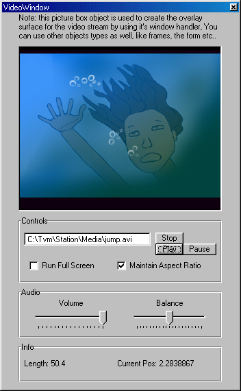



## ActiveMovie Control Module

### Description

This module allows you to easily implement and control Video objects (Without the un-stable MediaPlayer object) using DirectX ActiveMovie(DirectShow) object. Vastly documented, very easy to use! Including example project.

Don't forget to add a reference to 'ActiveMovie Control Library' in your project if using the module.
 
### More Info
 

             |
---                |---
**Submitted On**   |2003-12-16 06:07:02
**By**             |[Fade \(Amit Ben Shahar\)](https://github.com/Planet-Source-Code/PSCIndex/blob/master/ByAuthor/fade-amit-ben-shahar.md)
**Level**          |Intermediate
**User Rating**    |5.0 (65 globes from 13 users)
**Compatibility**  |VB 5\.0, VB 6\.0
**Category**       |[Miscellaneous](https://github.com/Planet-Source-Code/PSCIndex/blob/master/ByCategory/miscellaneous__1-1.md)
**World**          |[Visual Basic](https://github.com/Planet-Source-Code/PSCIndex/blob/master/ByWorld/visual-basic.md)
**Archive File**   |[ActiveMovi16843112162003\.zip](https://github.com/Planet-Source-Code/fade-amit-ben-shahar-activemovie-control-module__1-50480/archive/master.zip)

